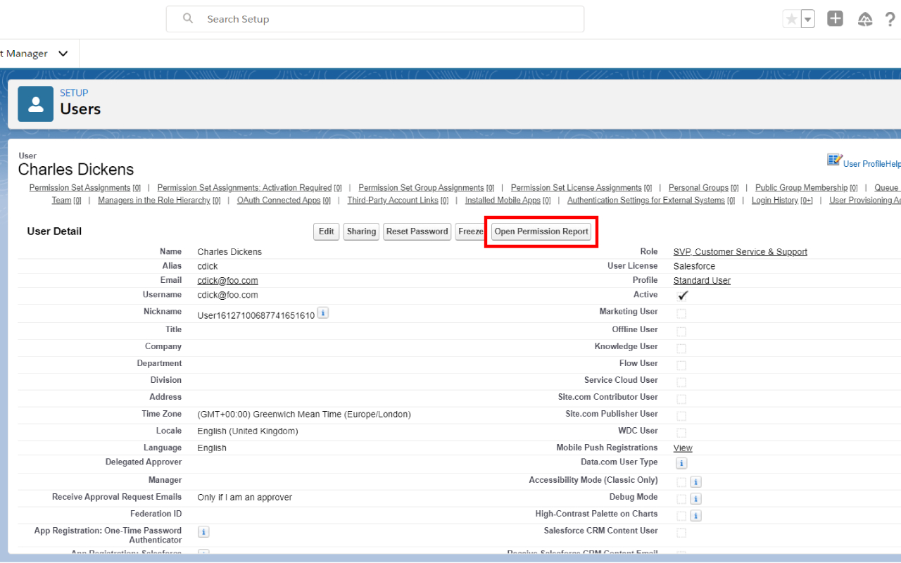
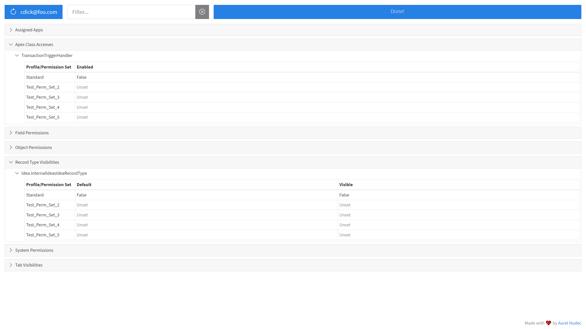

# Salesforce User Permission Report

Are you tired of wading through a user's Profile and Permission Sets trying to find that ONE permission they seem to have?

Salesforce User Permission Report is here to help. This tool reads all of the user's Profile and Permission Set metadata, merges it, and presents it in a single view allowing busy admins and developers to quickly troubleshoot security issues and permissions!

#### Features
 - Filtering
 - Intuitive tree view
 - Consolidated view of user permissions

## Download

This extension is available on the [Chrome Web Store](https://chrome.google.com/webstore/detail/salesforce-user-permissio/gkibdicghcpcikhjpgjoijpobdipklnp).

## Usage

Navigate to any user detail record in Classic or Lightning and click the "Open Permission Report" button next to the "Change Password" button.

## Screenshots

## Support

Please create an issue using the Bug Report template and provide the information requested in the template.

**If you do not have a GitHub account**, please use the "Support" section on the Chrome Web Store listing.