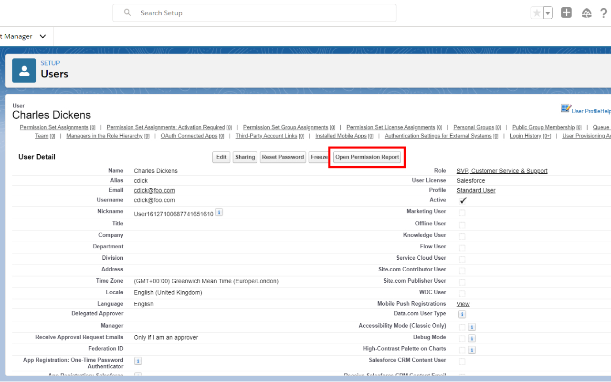
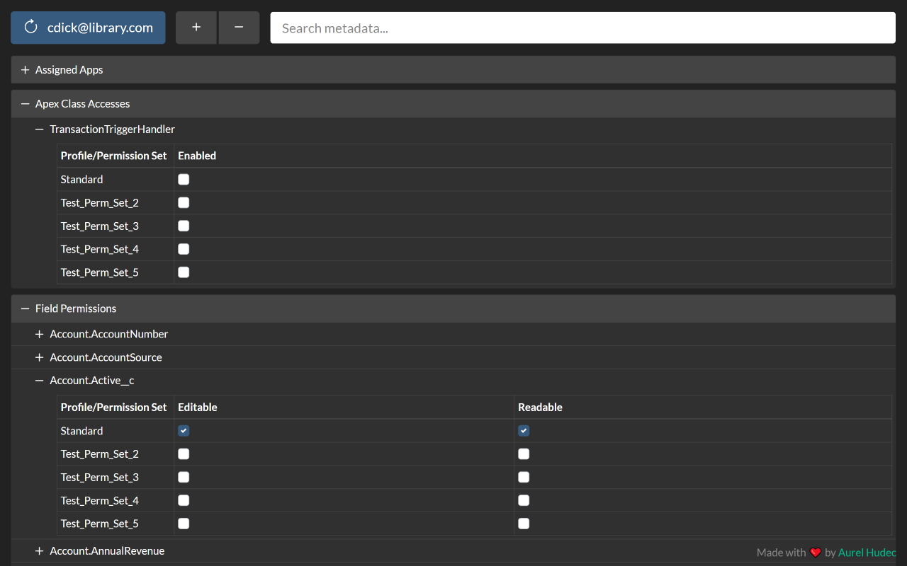
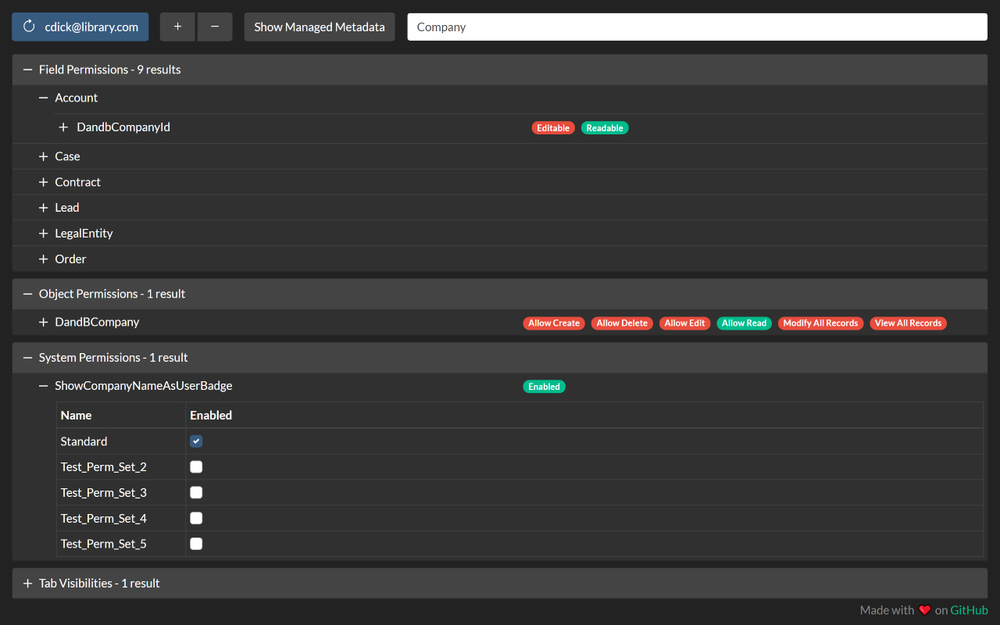
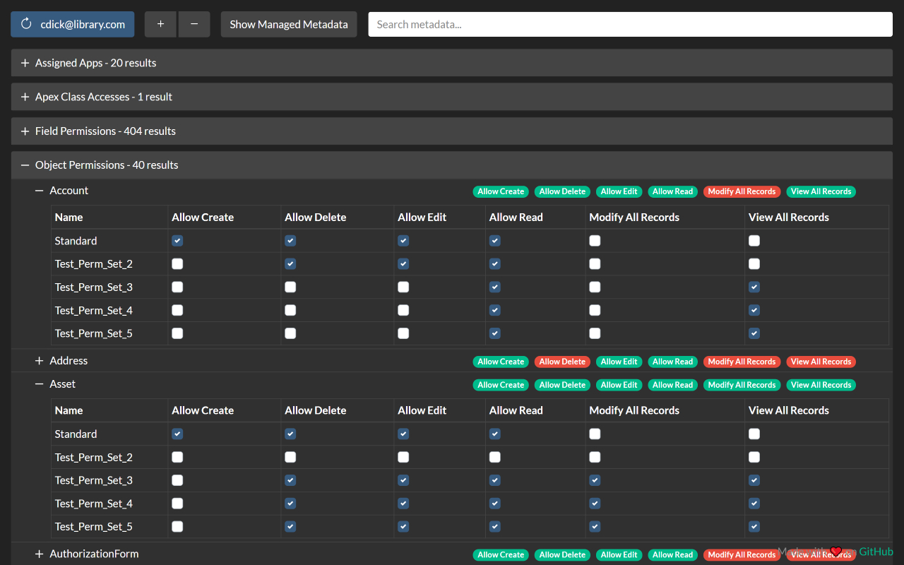

# SUPR - Salesforce User Permission Report

Salesforce User Permission Report allows you to see a report of all the permissions a user has and where they are set.

Features
 - Search
 - Dark mode
 - Intuitive tree view
 - Toggle managed metadata
 - Permission Set Group support
 - Consolidated view of user permissions
 - Compatible with Classic and Lightning Experience

Roadmap
 - ✅ Edge support
 - ✅ Various QoL & UI improvements

## Download

This extension is compatible with: Chrome 88, Edge 88 or later.

## Usage

Navigate to any user detail record in Classic or Lightning and click the "Open Permission Report" button next to the "Change Password" button.

## Screenshots

    
    

    
    

## Security/Privacy

No data is stored by the extension in the browser (apart from in-memory during use) and no data is transferred to third-party (i.e. non-Salesforce) servers. All communication is secured using HTTPS/TLS, so in theory the unencrypted (plain text) data is only visible in your Salesforce org and in the extension when it is used.

A network request is made to the SOAP API's `getUserInfo` resource which may contain the running user's PII as described here: https://developer.salesforce.com/docs/atlas.en-us.api.meta/api/sforce_api_calls_getuserinfo.htm

The only other piece of PII is the target user's username which is queried and displayed on the refresh button.

## Q&A

**Q**: I can't install the extension because it says "Not Compatible" on Chrome Web Store?

**A**: The extension requires Chrome 88 or later, to make sure you're on the latest Chrome version:
1. At the top right, click the 3 vertical dots.
2. Click Help -> About Google Chrome.
3. Wait for Chrome to download update.
4. Relaunch Chrome.

 

**Q**: What does "Session expired or invalid"/"INVALID_SESSION_ID" mean?

**A**: This is because your session has timed out and you've been logged out of Salesforce, please log back in and refresh the page.

 

**Q**: Why does it take so long to load?

**A**: Some requests made to Salesforce are made to the Tooling API which can be significantly slower than expected. Requests are also made to the Metadata SOAP API which is also slow.

 

**Q**: Is this extension available on Firefox/Safari?

**A**: I plan on making the extension available on Firefox. I do not have a Mac so I'm not planning for Safari support.

## Support

Please create an issue using the Bug Report template and provide the information requested in the template.

**If you do not have a GitHub account**, please use the "Support" section on the Chrome Web Store listing.