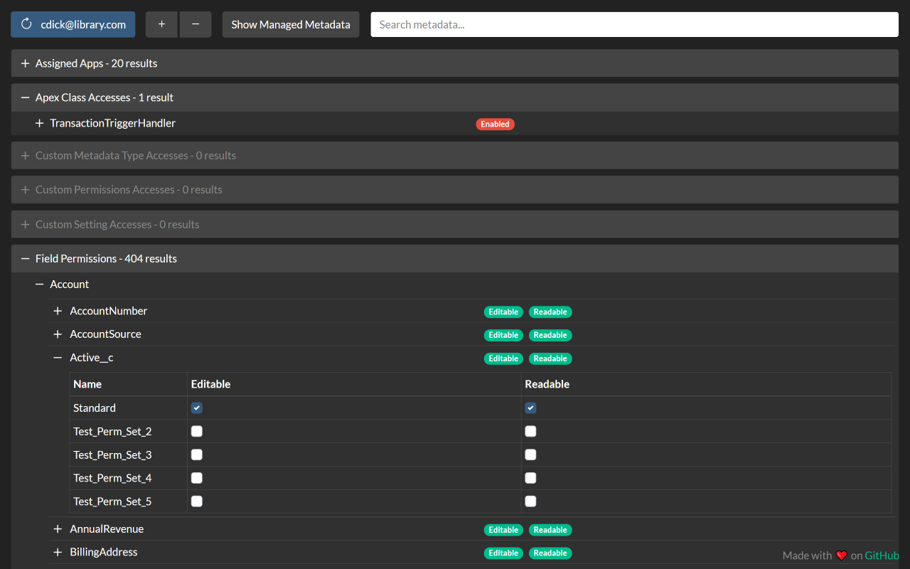

# Salesforce User Permission Report

Salesforce User Permission Report allows you to see a report of all the permissions a user has and which permission set or profile grants the permission.

#### Features
 - Filtering
 - Intuitive tree view
 - Consolidated view of user permissions
 - Compatible with Classic and Lightning Experience

## Download

## Usage

Navigate to any user detail record in Classic or Lightning and click the "Open Permission Report" button next to the "Change Password" button.

## Screenshots

    
    

    
    

## Support

Please create an issue using the Bug Report template and provide the information requested in the template.

**If you do not have a GitHub account**, please use the "Support" section on the Chrome Web Store listing.

## FAQ

**Q**: What does "Session expired or invalid"/"INVALID_SESSION_ID" mean?

**A**: This is because your session has timed out and you've been logged out of Salesforce, please log back in and refresh the page.